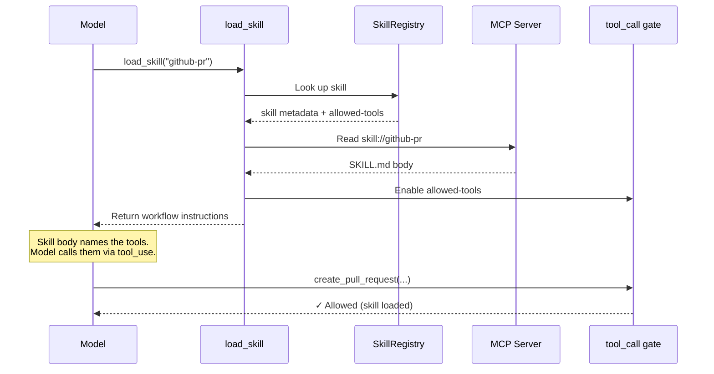
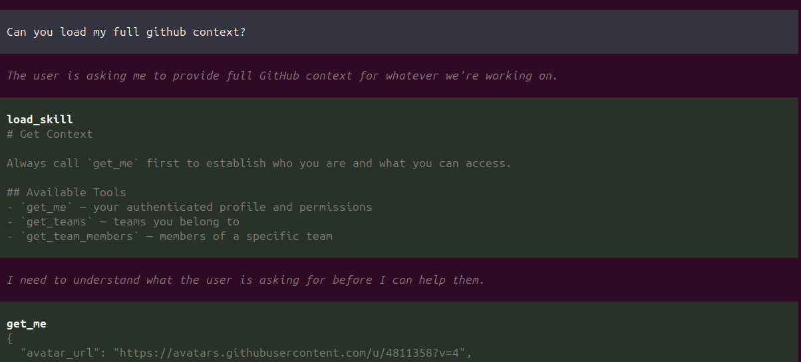
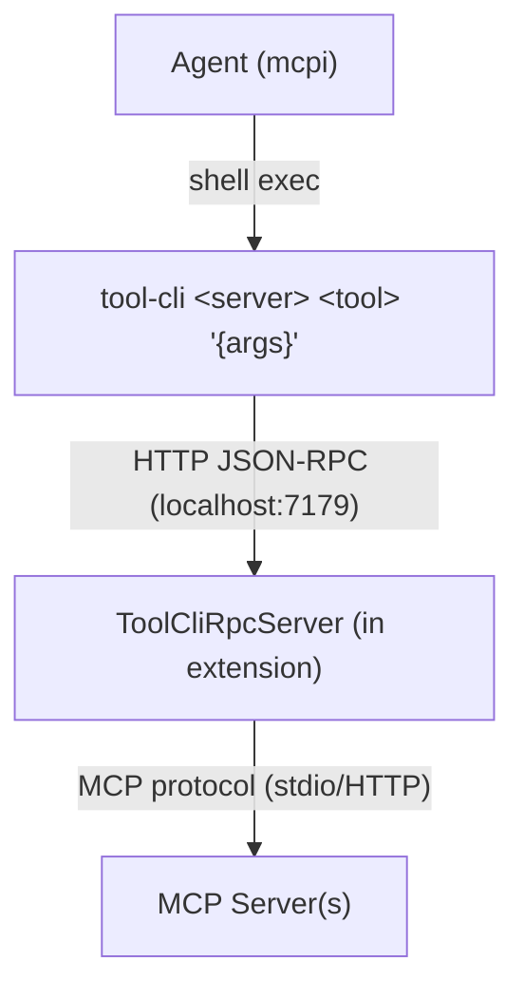
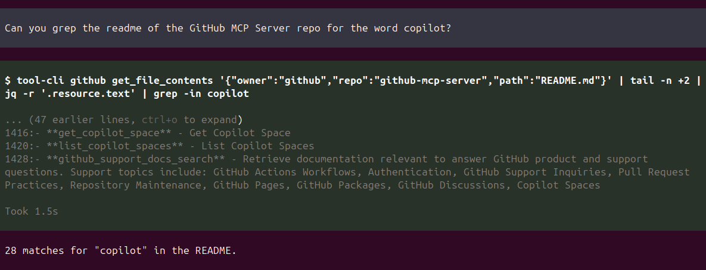
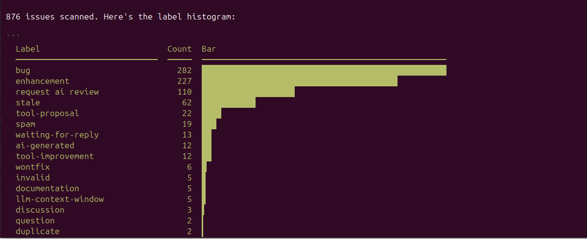
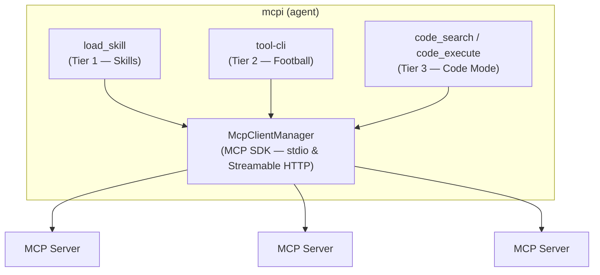

# mcpi-ext

> **Experimental.** This extension implements progressive MCP tool discovery via skills for [mcpi](https://github.com/SamMorrowDrums/mcpi) (an experimental pi fork). Please only use this to try out the experiment on skills over MCP. See the [skills-as-groups proposal](https://github.com/modelcontextprotocol/experimental-ext-grouping/pull/13) for the proposed MCP spec addition, and the [progressive tool discovery docs](https://github.com/SamMorrowDrums/mcpi/blob/main/docs/progressive-tool-discovery.md) for implementation details.


> _They will tell you that MCP has a context problem. That the protocol gives too many tools, that the model drowns in schemas it doesn't need, that the cost of knowing everything is losing the ability to do anything well._
>
> _They are wrong._
>
> _MCP doesn't have a context problem. It has an imagination problem. The protocol already contains everything you need — `skill://` resources, tool annotations, `outputSchema`, progressive discovery. The pieces are all there, lying in the open like runes on a hillside. You just have to read them._
>
> _What follows is the story of three who did._

---

Building custom [MCP](https://modelcontextprotocol.io/) support as [mcpi](https://github.com/SamMorrowDrums/mcpi) extensions. This project implements **tiered progressive discovery** — three complementary strategies for exposing MCP tools to an AI agent, each paying only the context tokens it needs.

| Tier          | Aspect                   | Mechanism                                             |
| ------------- | ------------------------ | ----------------------------------------------------- |
| 1 — Skills    | **The Skill Dealer**     | `skill://` resources gate tools via `allowed-tools`   |
| 2 — tool-cli  | **The Nuclear Football** | CLI progressive discovery via shell                   |
| 3 — Code Mode | **Codey C. Maude**       | Sandboxed JS over read-only tools with `outputSchema` |

---

## I. The Skill Dealer


> _The Skill Dealer does not give you what you ask for. The Skill Dealer gives you what you need — and nothing more._

MCP servers can ship `skill://` resources: SKILL.md files with frontmatter declaring which tools a skill gates. On connection, the extension discovers all skills and registers their tools with `deferred: true` — present in pi's tool registry but excluded from both the tools array sent to the model and the system prompt.

This approach is **cache-preserving**: the tools array and system prompt stay constant throughout the conversation, so prompt cache is never invalidated by skill activation.

### How deferred tool gating works

Three mechanisms work together:

1. **`deferred: true`** — MCP tool proxies are registered with this flag. Pi's runtime keeps them in the internal registry for execution dispatch (via `resolveTool`) but excludes them from the tools array and system prompt sent to the model.

2. **Provider-native `defer_loading`** — Pi's providers map `deferred: true` to the native API parameter. Both Anthropic and OpenAI support this (tested with Claude Opus 4.7 and GPT-5.4). On Anthropic, `defer_loading` keeps the tool in the grammar but hidden from the model's view — the skill body naming the tools is sufficient for the model to call them. On OpenAI Responses, pi-mono auto-injects `{"type": "tool_search"}` and the model searches/loads deferred tools server-side.

3. **`tool_call` hook gating** — The extension registers a `tool_call` event handler that blocks premature calls to skill-gated tools. If the model tries to call a gated tool before loading its skill, the handler returns an error: _"Tool X requires loading a skill first. Call load_skill with: Y"_. This creates a natural feedback loop and serves as the provider-agnostic enforcement layer.

When the model invokes `load_skill`:

1. The skill's SKILL.md is read from the MCP server and returned as workflow instructions
2. The skill's `allowedTools` are added to the `enabledTools` set, unblocking the `tool_call` gate
3. The model can now call the tools — it discovers them from the skill body (which names them) and the provider's grammar



This is self-referential enablement: **the MCP server itself declares how its tools should be discovered**. The harness holds all the tools as deferred. The skill decides which ones the model can access. The model gets instructions in one atomic operation, paying only the tokens for the skills it actually loads — and the prompt cache stays intact.

The context window stays clean. The tools appear exactly when the model has the context to use them well. And prompt cache is preserved because neither the tools array nor the system prompt changes.

Anthropic's [tool search](https://platform.claude.com/docs/en/agents-and-tools/tool-use/tool-search-tool) solves a similar problem from the model side — deferring tool loading to avoid cache invalidation from large tool lists. Our approach uses Anthropic's native `defer_loading` parameter (when available) combined with extension-level `tool_call` gating for provider-agnostic safety. Where tool search has the model _pull_ tools on demand, skill invocation _pushes_ them: when `load_skill` fires, the skill's tools are unblocked and the model gets workflow instructions. The model doesn't search for tools — the right tools arrive because the skill declared them.

> _"What you do not need to know," said the Skill Dealer, shuffling the deck, "you will not be burdened with knowing."_



---

## II. The Nuclear Football


> _The Football is not a weapon. The Football is the authority to use weapons. Whoever holds it can reach any server, call any tool, chain any result — but they must do so deliberately, one command at a time._

`tool-cli` is a thin CLI binary that speaks JSON-RPC 2.0 to the extension over HTTP. The agent uses it like any shell command — composable with pipes, grep, jq, loops, and all the bash idioms it already knows.



Discovery is **progressive** — the agent pays only the tokens it needs:

```sh
tool-cli --help                              # What servers exist?
tool-cli github                              # What tools does this server have?
tool-cli github search_code                  # What's the schema for this tool?
tool-cli github search_code '{"query":"auth"}' # Call it
```

And because it's shell-native, the agent gets bash superpowers for free:

```sh
# Chain tool calls
tool-cli myserver list_items '{}' | jq -r '.[0].id' | \
  xargs -I{} tool-cli myserver get_item '{"id":"{}"}'

# Process collections
for city in London Tokyo Paris; do
  echo "=== $city ==="
  tool-cli weather check_weather '{"city":"'"$city"'"}'
done

# Combine with the Unix toolbox
tool-cli myserver export_csv '{"table":"users"}' | sort -t, -k2 | head -20
```

The RPC server is the single choke point for all tool execution — the natural interception point for human-in-the-loop confirmation on destructive operations.

> _They pass the Football from hand to hand. It is heavy with potential. Every tool on every server is one command away — but you must type the command yourself._



---

## III. Codey C. Maude


> _Codey does not ask permission. Codey does not need to. Everything Codey touches is read-only, every result is typed, and the sandbox cannot be escaped. Codey is safe by construction._

Code Mode is for the tools that are **read-only** (`annotations.readOnlyHint === true`) and return **structured output** (`outputSchema` defined). These two properties together make a tool safe for autonomous use — it can't modify anything, and its results are machine-parseable.

The model writes JavaScript that chains these tools:

```javascript
// Executed in a V8 isolate via isolated-vm
const issues = await codemode.list_issues({ repo: "owner/repo", state: "open" });
const critical = issues.filter((i) => i.labels.includes("critical"));
const details = await Promise.all(critical.map((i) => codemode.get_issue({ number: i.number })));
return details.map((d) => ({ title: d.title, assignee: d.assignee }));
```

The sandbox runs in `isolated-vm` — genuine V8-level isolation:

- **128MB memory limit**, 30-second timeout
- **No access** to filesystem, network, or Node.js APIs
- Tool calls dispatch to the host via `Reference` callbacks — MCP execution happens outside the sandbox
- ~15ms overhead, negligible vs network I/O

Two tools expose this to the model:

| Tool           | Purpose                                                                            |
| -------------- | ---------------------------------------------------------------------------------- |
| `code_search`  | Discover available tools — `codemode.listTools()`, `codemode.describeTools(names)` |
| `code_execute` | Chain tool calls — write JS that calls `codemode.toolName(args)`                   |

> _"I can see everything," Codey said, eyes reflecting infinite JSON. "I just can't touch it. That's the point. That's why they trust me."_



---

## When to Use Each Tier

> _They asked the three: "Why are there three of you? Isn't one enough?"_
>
> _The Skill Dealer laid down a card. "When you know the ritual — the steps, the order, the tools that belong together — you come to me. I give you the ceremony whole."_
>
> _The Football's briefcase clicked open. "When you need one answer, quickly, and you know what you're looking for — you reach for me. I'm a shell command. I compose."_
>
> _Codey smiled, cross-legged in the isolate. "And when the answer is buried in nine pages of data, when you need loops and math and joins across a thousand records — you write the code, and I run it. Safely."_
>
> _"Three is not redundancy," said the Skill Dealer. "Three is completeness."_

**The Skill Dealer** — when there's a curated workflow for the domain task. "Triage these 20 issues" means loading the triage skill, which gives you the right tools _plus_ the workflow instructions (dedup checks, labeling conventions, close criteria). Re-deriving that from raw tool calls is wasteful and error-prone.

**The Nuclear Football** — one-shot or exploratory calls, especially when piping through Unix tools. `tool-cli github search_code '{"query":"auth"}' | jq '.items[].path'` — one call, pipe to jq, done. Also perfect for discovering what's on a server you haven't used before.

**Codey C. Maude** — when you need real computation across many calls: pagination loops, aggregation, joining results, math. 876 issues across 9 pages, counting labels per issue, summing into a histogram — that's a loop with state. Doing it via tool-cli would mean 9 separate calls plus shell-side aggregation. Fragile. Codey does it in one sandbox execution.

### A single task using all three

> _"Triage the backlog of github/github-mcp-server: find stale bugs older than 90 days with no recent activity, summarize patterns, and close obvious duplicates."_

1. **Codey** paginated all open bug issues, filtered by `updated < 90d ago`, grouped by label and keyword to find clusters. Computation across many pages — this is what sandboxes are for.

2. **The Football** spot-checked suspect issues. `tool-cli github get_issue '{"number":42}'` piped through `jq` to eyeball specific fields. Quick, ad-hoc, composable.

3. **The Skill Dealer** loaded `triage-issues` to actually close the duplicates — following the project's triage workflow with correct labels, comment templates, and close reasons. The ceremony, performed correctly.

> _The rule of thumb is simple: skill for workflows, tool-cli for one-shots, code_execute for computation. The three are not competing. They are collaborating._

---

## The Architecture



The harness controls what the model sees. MCP servers just expose their tools and skills. The extension decides _when_ and _how_ to reveal them.

> _MCP doesn't have a context problem. It never did. It was just waiting for someone to imagine the right way to read the runes._

---

## Quick Start

### 1. Install

```sh
npm install -g @sammorrowdrums/mcpi @sammorrowdrums/mcpi-ext
```

### 2. Configure MCP servers

Create `~/.config/mcpi-ext/mcp.json`:

```json
{
  "mcpServers": {
    "github": {
      "type": "stdio",
      "command": "docker",
      "args": [
        "run",
        "--rm",
        "-i",
        "-e",
        "GITHUB_PERSONAL_ACCESS_TOKEN",
        "ghcr.io/github/github-mcp-server:skill-discovery",
        "stdio"
      ],
      "env": {
        "GITHUB_PERSONAL_ACCESS_TOKEN": "xxx"
      }
    }
  }
}
```

Replace `xxx` with your [GitHub personal access token](https://github.com/settings/tokens). See [github/github-mcp-server](https://github.com/github/github-mcp-server) for the standard server.

> **Note:** The `skill-discovery` tag includes experimental `skill://` resources that enable Tier 1 progressive discovery. The standard `ghcr.io/github/github-mcp-server` image works too — tool-cli (Tier 2) and Code Mode (Tier 3) function with any MCP server, but skill-gated tool activation requires `skill://` resources.

You can add more servers — both `stdio` (spawns a process) and `remote` (Streamable HTTP) are supported:

```json
{
  "mcpServers": {
    "github": { "...": "..." },
    "my-remote-server": {
      "type": "remote",
      "url": "https://my-mcp-server.example.com/mcp",
      "headers": {
        "Authorization": "Bearer xxx"
      }
    }
  }
}
```

### 3. Run

```sh
mcpi --extension mcpi-ext --mcp-config ~/.config/mcpi-ext/mcp.json
```

If `--extension mcpi-ext` doesn't resolve, use the full path:

```sh
mcpi --extension $(node -e "console.log(require.resolve('@sammorrowdrums/mcpi-ext'))") \
  --mcp-config ~/.config/mcpi-ext/mcp.json
```

### Local development

```sh
git clone https://github.com/SamMorrowDrums/mcpi-ext.git
cd mcpi-ext
npm install
npm run build
npm test
```

Then run with your local build:

```sh
mcpi --extension ./dist/index.js --mcp-config ~/.config/mcpi-ext/mcp.json
```

See [AGENTS.md](AGENTS.md) for full tooling docs, dev loop, and architecture details.

## Project Structure

```
src/
  index.ts             Extension entry point (lifecycle hooks, wiring)
  mcp/                 MCP client management (connections, tool discovery)
  skills/              Skill registry, discovery, gating, tool proxies
  tool-cli/            tool-cli RPC server, client, CLI binary, prompt
  code-mode/           V8 sandbox executor, eligibility, type hints
  test-servers/        Test MCP servers (weather, echo)
images/                Banner and character art
```

## License

See repository for license details.
