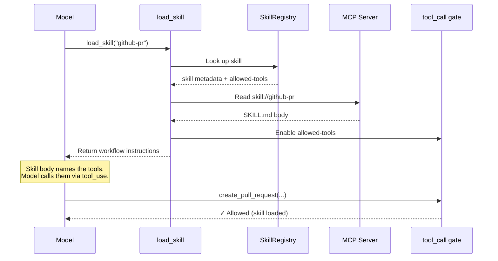
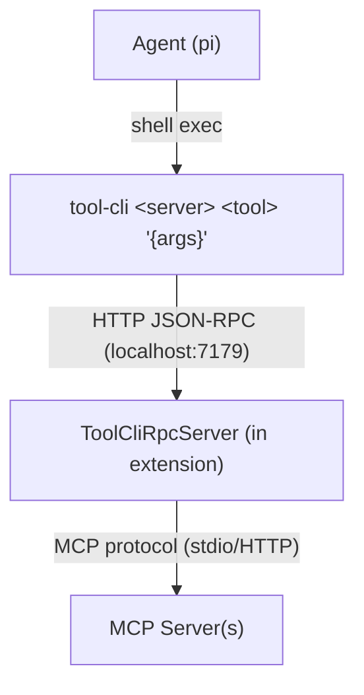
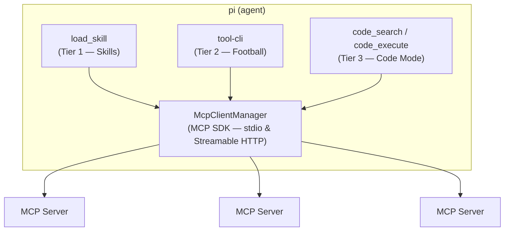

# pi-mcp-agent


> _They will tell you that MCP has a context problem. That the protocol gives too many tools, that the model drowns in schemas it doesn't need, that the cost of knowing everything is losing the ability to do anything well._
>
> _They are wrong._
>
> _MCP doesn't have a context problem. It has an imagination problem. The protocol already contains everything you need — `skill://` resources, tool annotations, `outputSchema`, progressive discovery. The pieces are all there, lying in the open like runes on a hillside. You just have to read them._
>
> _What follows is the story of three who did._

---

Building custom [MCP](https://modelcontextprotocol.io/) support as [pi](https://pi.dev/) extensions. This project implements **tiered progressive discovery** — three complementary strategies for exposing MCP tools to an AI agent, each paying only the context tokens it needs.

| Tier          | Aspect                   | Mechanism                                             |
| ------------- | ------------------------ | ----------------------------------------------------- |
| 1 — Skills    | **The Skill Dealer**     | `skill://` resources gate tools via `allowed-tools`   |
| 2 — tool-cli  | **The Nuclear Football** | CLI progressive discovery via shell                   |
| 3 — Code Mode | **Codey C. Maude**       | Sandboxed JS over read-only tools with `outputSchema` |

---

## I. The Skill Dealer


> _The Skill Dealer does not give you what you ask for. The Skill Dealer gives you what you need — and nothing more._

MCP servers can ship `skill://` resources: SKILL.md files with frontmatter declaring which tools a skill gates. On connection, the extension discovers all skills and registers their tools with `deferred: true` — present in pi's tool registry but excluded from both the tools array sent to the model and the system prompt.

This approach is **cache-preserving**: the tools array and system prompt stay constant throughout the conversation, so prompt cache is never invalidated by skill activation.

### How deferred tool gating works

Three mechanisms work together:

1. **`deferred: true`** — MCP tool proxies are registered with this flag. Pi's runtime keeps them in the internal registry for execution dispatch (via `resolveTool`) but excludes them from the tools array and system prompt sent to the model.

2. **Provider-native `defer_loading`** — Pi's providers map `deferred: true` to the native API parameter. Both Anthropic and OpenAI support this (tested with Claude Opus 4.7 and GPT-5.4). On Anthropic, the tool is hidden until enabled via a `tool_reference` content block. On OpenAI Responses, pi-mono auto-injects `{"type": "tool_search"}` and the model searches/loads deferred tools server-side.

3. **`tool_call` hook gating** — The extension registers a `tool_call` event handler that blocks premature calls to skill-gated tools. If the model tries to call a gated tool before loading its skill, the handler returns an error: _"Tool X requires loading a skill first. Call load_skill with: Y"_. This creates a natural feedback loop and serves as the provider-agnostic enforcement layer.

When the model invokes `load_skill`:

1. The skill's SKILL.md is read from the MCP server and returned as workflow instructions
2. The skill's `allowedTools` are added to the `enabledTools` set, unblocking the `tool_call` gate
3. The model can now call the tools — it discovers them from the skill body (which names them) and the provider's grammar



This is self-referential enablement: **the MCP server itself declares how its tools should be discovered**. The harness holds all the tools as deferred. The skill decides which ones the model can access. The model gets instructions in one atomic operation, paying only the tokens for the skills it actually loads — and the prompt cache stays intact.

The context window stays clean. The tools appear exactly when the model has the context to use them well. And prompt cache is preserved because neither the tools array nor the system prompt changes.

Anthropic's [tool search](https://platform.claude.com/docs/en/agents-and-tools/tool-use/tool-search-tool) solves a similar problem from the model side — deferring tool loading to avoid cache invalidation from large tool lists. Our approach uses Anthropic's native `defer_loading` parameter (when available) combined with extension-level `tool_call` gating for provider-agnostic safety. Where tool search has the model _pull_ tools on demand, skill invocation _pushes_ them: when `load_skill` fires, the skill's tools are unblocked and the model gets workflow instructions. The model doesn't search for tools — the right tools arrive because the skill declared them.

> _"What you do not need to know," said the Skill Dealer, shuffling the deck, "you will not be burdened with knowing."_

---

## II. The Nuclear Football


> _The Football is not a weapon. The Football is the authority to use weapons. Whoever holds it can reach any server, call any tool, chain any result — but they must do so deliberately, one command at a time._

`tool-cli` is a thin CLI binary that speaks JSON-RPC 2.0 to the extension over HTTP. The agent uses it like any shell command — composable with pipes, grep, jq, loops, and all the bash idioms it already knows.



Discovery is **progressive** — the agent pays only the tokens it needs:

```sh
tool-cli --help                              # What servers exist?
tool-cli github                              # What tools does this server have?
tool-cli github search_code                  # What's the schema for this tool?
tool-cli github search_code '{"query":"auth"}' # Call it
```

And because it's shell-native, the agent gets bash superpowers for free:

```sh
# Chain tool calls
tool-cli myserver list_items '{}' | jq -r '.[0].id' | \
  xargs -I{} tool-cli myserver get_item '{"id":"{}"}'

# Process collections
for city in London Tokyo Paris; do
  echo "=== $city ==="
  tool-cli weather check_weather '{"city":"'"$city"'"}'
done

# Combine with the Unix toolbox
tool-cli myserver export_csv '{"table":"users"}' | sort -t, -k2 | head -20
```

The RPC server is the single choke point for all tool execution — the natural interception point for human-in-the-loop confirmation on destructive operations.

> _They pass the Football from hand to hand. It is heavy with potential. Every tool on every server is one command away — but you must type the command yourself._

---

## III. Codey C. Maude


> _Codey does not ask permission. Codey does not need to. Everything Codey touches is read-only, every result is typed, and the sandbox cannot be escaped. Codey is safe by construction._

Code Mode is for the tools that are **read-only** (`annotations.readOnlyHint === true`) and return **structured output** (`outputSchema` defined). These two properties together make a tool safe for autonomous use — it can't modify anything, and its results are machine-parseable.

The model writes JavaScript that chains these tools:

```javascript
// Executed in a V8 isolate via isolated-vm
const issues = await codemode.list_issues({ repo: "owner/repo", state: "open" });
const critical = issues.filter((i) => i.labels.includes("critical"));
const details = await Promise.all(critical.map((i) => codemode.get_issue({ number: i.number })));
return details.map((d) => ({ title: d.title, assignee: d.assignee }));
```

The sandbox runs in `isolated-vm` — genuine V8-level isolation:

- **128MB memory limit**, 30-second timeout
- **No access** to filesystem, network, or Node.js APIs
- Tool calls dispatch to the host via `Reference` callbacks — MCP execution happens outside the sandbox
- ~15ms overhead, negligible vs network I/O

Two tools expose this to the model:

| Tool           | Purpose                                                                            |
| -------------- | ---------------------------------------------------------------------------------- |
| `code_search`  | Discover available tools — `codemode.listTools()`, `codemode.describeTools(names)` |
| `code_execute` | Chain tool calls — write JS that calls `codemode.toolName(args)`                   |

> _"I can see everything," Codey said, eyes reflecting infinite JSON. "I just can't touch it. That's the point. That's why they trust me."_

---

## The Architecture

The three tiers are complementary. Skills give curated access with workflow knowledge. The Football gives interactive access with safety. Code Mode gives autonomous access to safe operations at scale.



The harness controls what the model sees. MCP servers just expose their tools and skills. The extension decides _when_ and _how_ to reveal them.

> _MCP doesn't have a context problem. It never did. It was just waiting for someone to imagine the right way to read the runes._

---

## Quick Start

```sh
curl https://mise.run | sh                       # install mise
eval "$(~/.local/bin/mise activate bash)"         # activate
mise install                                      # install node
npm install                                       # install dependencies
mise run build                                    # build
mise run test                                     # test
```

Load the extension with pi:

```sh
pi --extension ./dist/index.js
```

See [AGENTS.md](AGENTS.md) for full tooling docs, dev loop, and architecture details.

## Project Structure

```
src/
  index.ts             Extension entry point (lifecycle hooks, wiring)
  mcp/                 MCP client management (connections, tool discovery)
  skills/              Skill registry, discovery, gating, tool proxies
  tool-cli/            tool-cli RPC server, client, CLI binary, prompt
  code-mode/           V8 sandbox executor, eligibility, type hints
  test-servers/        Test MCP servers (weather, echo)
images/                Banner and character art
```

## License

See repository for license details.
