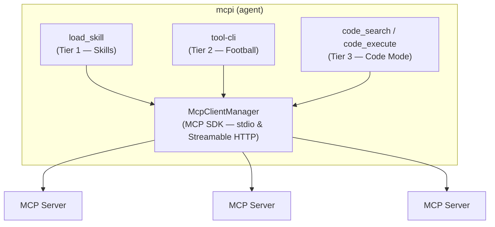

# mcpi-ext

> **Experimental.** This extension implements progressive MCP tool discovery via skills for [mcpi](https://github.com/SamMorrowDrums/mcpi) (an experimental pi fork). Please only use this to try out the experiment on skills over MCP. See the [skills-as-groups proposal](https://github.com/modelcontextprotocol/experimental-ext-grouping/pull/13) for the proposed MCP spec addition, and the [progressive tool discovery docs](https://github.com/SamMorrowDrums/mcpi/blob/main/docs/progressive-tool-discovery.md) for implementation details.


> _They will tell you that MCP has a context problem. That the protocol gives too many tools, that the model drowns in schemas it doesn't need, that the cost of knowing everything is losing the ability to do anything well._
>
> _They are wrong._
>
> _MCP doesn't have a context problem. It has an imagination problem. The protocol already contains everything you need — `skill://` resources, tool annotations, `outputSchema`, progressive discovery. The pieces are all there, lying in the open like runes on a hillside. You just have to read them._
>
> _What follows is the story of three who did._

---

Building custom [MCP](https://modelcontextprotocol.io/) support as [mcpi](https://github.com/SamMorrowDrums/mcpi) extensions. This project implements **tiered progressive discovery** — three complementary strategies for exposing MCP tools to an AI agent, each paying only the context tokens it needs.

| Tier          | Aspect                   | Mechanism                                             |
| ------------- | ------------------------ | ----------------------------------------------------- |
| 1 — Skills    | **The Skill Dealer**     | `skill://` resources gate tools via `allowed-tools`   |
| 2 — tool-cli  | **The Nuclear Football** | CLI progressive discovery via shell                   |
| 3 — Code Mode | **Codey C. Maude**       | Sandboxed JS over read-only tools with `outputSchema` |

---

## I. The Skill Dealer


> _The Skill Dealer does not give you what you ask for. The Skill Dealer gives you what you need — and nothing more._

MCP servers ship `skill://` resources — SKILL.md files declaring which tools a skill gates. The extension discovers skills on connection and registers their tools with `deferred: true`: present in the registry for dispatch but hidden from the model and the prompt. **Cache is preserved** — neither the tools array nor the system prompt ever changes.

When the model calls `load_skill`, the skill's instructions arrive and its tools are unblocked. The model discovers tools from the skill body and can call them immediately. The MCP server itself declares how its tools should be discovered.

📖 [**How it works →**](docs/skills.md) — deferred gating, `defer_loading` provider support, `tool_call` hook enforcement.

> _"What you do not need to know," said the Skill Dealer, shuffling the deck, "you will not be burdened with knowing."_


---

## II. The Nuclear Football


> _The Football is not a weapon. The Football is the authority to use weapons. Whoever holds it can reach any server, call any tool, chain any result — but they must do so deliberately, one command at a time._

`tool-cli` is a thin CLI binary that speaks JSON-RPC to the extension. The agent uses it like any shell command — composable with pipes, grep, jq, loops. Discovery is progressive: server list → tool list → schema → call. Each step pays only the tokens it needs.

📖 [**How it works →**](docs/tool-cli.md) — architecture, progressive discovery, shell composability.

> _They pass the Football from hand to hand. It is heavy with potential. Every tool on every server is one command away — but you must type the command yourself._


---

## III. Codey C. Maude


> _Codey does not ask permission. Codey does not need to. Everything Codey touches is read-only, every result is typed, and the sandbox cannot be escaped. Codey is safe by construction._

Code Mode targets **read-only** tools with **structured output**. The model writes JavaScript that chains MCP tool calls inside a V8 isolate — memory-limited, time-limited, no filesystem or network access. Perfect for pagination loops, aggregation, and joins across many calls.

📖 [**How it works →**](docs/code-mode.md) — sandbox isolation, eligibility, tool dispatch.

> _"I can see everything," Codey said, eyes reflecting infinite JSON. "I just can't touch it. That's the point. That's why they trust me."_


---

## When to Use Each Tier

> _They asked the three: "Why are there three of you? Isn't one enough?"_
>
> _The Skill Dealer laid down a card. "When you know the ritual — the steps, the order, the tools that belong together — you come to me. I give you the ceremony whole."_
>
> _The Football's briefcase clicked open. "When you need one answer, quickly, and you know what you're looking for — you reach for me. I'm a shell command. I compose."_
>
> _Codey smiled, cross-legged in the isolate. "And when the answer is buried in nine pages of data, when you need loops and math and joins across a thousand records — you write the code, and I run it. Safely."_
>
> _"Three is not redundancy," said the Skill Dealer. "Three is completeness."_

**The Skill Dealer** — when there's a curated workflow for the domain task. "Triage these 20 issues" means loading the triage skill, which gives you the right tools _plus_ the workflow instructions (dedup checks, labeling conventions, close criteria). Re-deriving that from raw tool calls is wasteful and error-prone.

**The Nuclear Football** — one-shot or exploratory calls, especially when piping through Unix tools. `tool-cli github search_code '{"query":"auth"}' | jq '.items[].path'` — one call, pipe to jq, done. Also perfect for discovering what's on a server you haven't used before.

**Codey C. Maude** — when you need real computation across many calls: pagination loops, aggregation, joining results, math. 876 issues across 9 pages, counting labels per issue, summing into a histogram — that's a loop with state. Doing it via tool-cli would mean 9 separate calls plus shell-side aggregation. Fragile. Codey does it in one sandbox execution.

### A single task using all three

> _"Triage the backlog of github/github-mcp-server: find stale bugs older than 90 days with no recent activity, summarize patterns, and close obvious duplicates."_

1. **Codey** paginated all open bug issues, filtered by `updated < 90d ago`, grouped by label and keyword to find clusters. Computation across many pages — this is what sandboxes are for.

2. **The Football** spot-checked suspect issues. `tool-cli github get_issue '{"number":42}'` piped through `jq` to eyeball specific fields. Quick, ad-hoc, composable.

3. **The Skill Dealer** loaded `triage-issues` to actually close the duplicates — following the project's triage workflow with correct labels, comment templates, and close reasons. The ceremony, performed correctly.

> _The rule of thumb is simple: skill for workflows, tool-cli for one-shots, code_execute for computation. The three are not competing. They are collaborating._

---

## The Architecture



The harness controls what the model sees. MCP servers just expose their tools and skills. The extension decides _when_ and _how_ to reveal them.

> _MCP doesn't have a context problem. It never did. It was just waiting for someone to imagine the right way to read the runes._

---

## Quick Start

### 1. Install

```sh
npm install -g @sammorrowdrums/mcpi @sammorrowdrums/mcpi-ext
```

### 2. Configure MCP servers

Create `~/.config/mcpi-ext/mcp.json`:

```json
{
  "mcpServers": {
    "github": {
      "type": "stdio",
      "command": "docker",
      "args": [
        "run",
        "--rm",
        "-i",
        "-e",
        "GITHUB_PERSONAL_ACCESS_TOKEN",
        "ghcr.io/github/github-mcp-server:skill-discovery",
        "stdio"
      ],
      "env": {
        "GITHUB_PERSONAL_ACCESS_TOKEN": "xxx"
      }
    }
  }
}
```

Replace `xxx` with your [GitHub personal access token](https://github.com/settings/tokens). See [github/github-mcp-server](https://github.com/github/github-mcp-server) for the standard server.

> **Note:** The `skill-discovery` tag includes experimental `skill://` resources that enable Tier 1 progressive discovery. The standard `ghcr.io/github/github-mcp-server` image works too — tool-cli (Tier 2) and Code Mode (Tier 3) function with any MCP server, but skill-gated tool activation requires `skill://` resources.

You can add more servers — both `stdio` (spawns a process) and `remote` (Streamable HTTP) are supported:

```json
{
  "mcpServers": {
    "github": { "...": "..." },
    "my-remote-server": {
      "type": "remote",
      "url": "https://my-mcp-server.example.com/mcp",
      "headers": {
        "Authorization": "Bearer xxx"
      }
    }
  }
}
```

### 3. Run

```sh
mcpi --extension $(npm root -g)/@sammorrowdrums/mcpi-ext/dist/index.js \
  --mcp-config ~/.config/mcpi-ext/mcp.json
```

### Local development

```sh
git clone https://github.com/SamMorrowDrums/mcpi-ext.git
cd mcpi-ext
npm install
npm run build
npm test
```

Then run with your local build:

```sh
mcpi --extension ./dist/index.js --mcp-config ~/.config/mcpi-ext/mcp.json
```

See [AGENTS.md](AGENTS.md) for full tooling docs, dev loop, and architecture details.

## Project Structure

```
src/
  index.ts             Extension entry point (lifecycle hooks, wiring)
  mcp/                 MCP client management (connections, tool discovery)
  skills/              Skill registry, discovery, gating, tool proxies
  tool-cli/            tool-cli RPC server, client, CLI binary, prompt
  code-mode/           V8 sandbox executor, eligibility, type hints
  test-servers/        Test MCP servers (weather, echo)
images/                Banner and character art
```

## License

See repository for license details.
