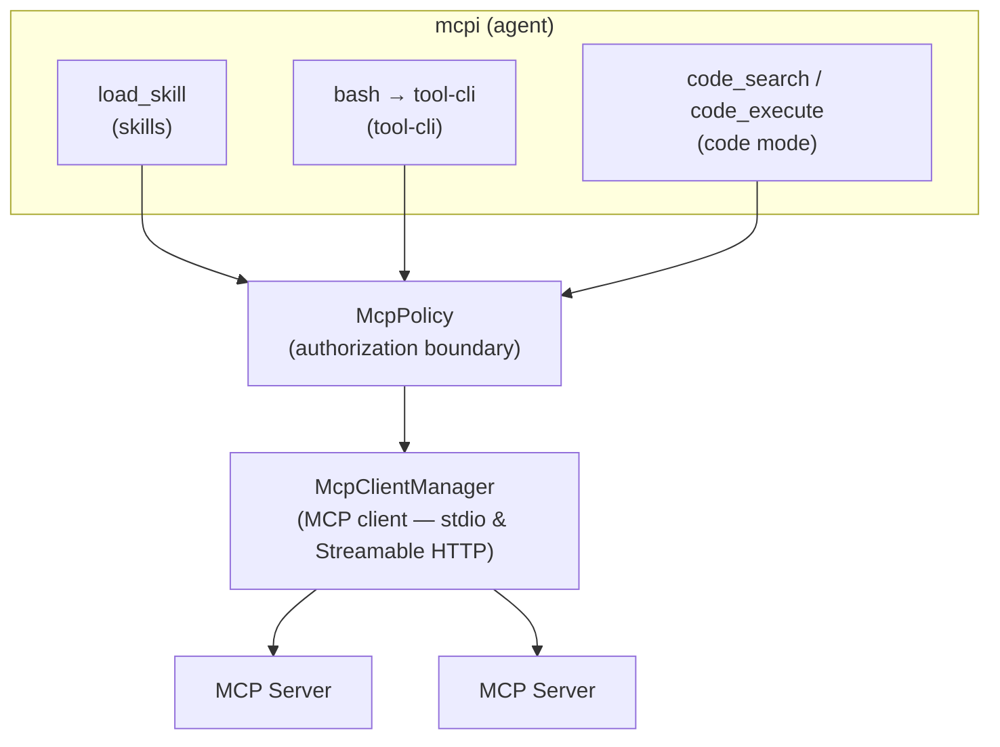

# mcpi-ext

[](https://www.npmjs.com/package/@sammorrowdrums/mcpi-ext)
[](https://www.npmjs.com/package/@sammorrowdrums/mcpi)
[](https://www.npmjs.com/package/@sammorrowdrums/tool-cli)

An extension for [mcpi](https://github.com/SamMorrowDrums/mcpi) that gives an agent three ways to
reach [MCP](https://modelcontextprotocol.io/) servers — **skills**, **tool-cli**, and **code mode** —
behind a single authorization boundary, so every call is authorized, audited, and gated in one place.

Each mechanism exists to spend only the context tokens a task actually needs. A large MCP server can
publish hundreds of tools; loading all of their schemas into every request is expensive and degrades
tool selection. These three mechanisms let the agent discover and call tools progressively instead.

- **[Skills](https://github.com/SamMorrowDrums/mcpi-ext/blob/main/docs/skills.md)** — the server
  publishes a documented workflow that unlocks a curated tool set on demand.
- **[tool-cli](https://github.com/SamMorrowDrums/mcpi-ext/blob/main/docs/tool-cli.md)** — a shell
  on-ramp for progressive discovery: servers → tools → schema → call.
- **[Code mode](https://github.com/SamMorrowDrums/mcpi-ext/blob/main/docs/code-mode.md)** —
  sandboxed JavaScript that chains read-only tool calls inside a V8 isolate.

---

## Quick start

Requires **`@sammorrowdrums/mcpi@0.85.2`** or newer: mcpi-ext declares a peer range of
`>=0.85.2 <1.0.0`, and requires `@sammorrowdrums/tool-cli` v1 for the bridge contract. Any mcpi-ext
`1.x` works; the commands below pin the current one.

The floor is 0.85.2 rather than 0.85.0 because progressive disclosure needs two host behaviours that
land in that patch: registration-time `deferred` metadata, so a direct tool proxy is genuinely hidden
from turn 0 rather than only after its first use, and `tool_reference` activation driven by
`addedToolNames` on a tool result. On an older host the extension still loads, but skill activation
reveals nothing and deferred definitions are not deferred — a silent degradation, which is why the
floor is expressed as a hard peer range rather than a note.

### 1. Check Node

Node.js `>=22.13.0`. Node 22 and 24 are both covered by CI.

```sh
node --version
```

### 2. Install mcpi and tool-cli globally

`mcpi` and `tool-cli` are commands you run, so they belong on your `PATH`:

```sh
npm install -g @sammorrowdrums/mcpi@0.85.2 @sammorrowdrums/tool-cli@1.0.2
```

To track the newest releases instead of the pinned pair, use `@latest`:

```sh
npm install -g @sammorrowdrums/mcpi@latest @sammorrowdrums/tool-cli@latest
```

### 3. Install the extension through mcpi

Do **not** install mcpi-ext globally and point `--extension` at it by hand. mcpi manages extension
packages itself, records them in its settings, and can update them later:

```sh
mcpi install npm:@sammorrowdrums/mcpi-ext
```

That takes the newest `1.x`, which is what most people want. To pin an exact version for a
reproducible setup, name it — this page documents `1.0.2`:

```sh
mcpi install npm:@sammorrowdrums/mcpi-ext@1.0.2
```

Confirm it registered:

```sh
mcpi list
```

```
User packages:
  npm:@sammorrowdrums/mcpi-ext@1.0.2
    ~/.cache/mcpi/npm/node_modules/@sammorrowdrums/mcpi-ext
```

`mcpi install` writes to `~/.config/mcpi/settings.json`. Add `-l` to install into the current
project's `.mcpi/settings.json` instead. Once a package is listed there, mcpi loads it on every
run — you never pass `--extension` for it again. The managed npm root intentionally does not
install another copy of mcpi; the host supplies its extension contract, while mcpi-ext carries its
own runtime dependencies.

### 4. Configure MCP servers

Create `~/.config/mcpi-ext/mcp.json`. That is the default path; `--mcp-config <path>` overrides it,
and a missing file is not an error — mcpi-ext simply starts with zero servers.

Keep your token **out of this file**. Write it to a private env file instead, created with
restrictive permissions from the start so the token is never briefly world-readable:

```sh
mkdir -p ~/.config/mcpi-ext
chmod 700 ~/.config/mcpi-ext
(umask 077 && gh auth token | sed 's/^/GITHUB_PERSONAL_ACCESS_TOKEN=/' > ~/.config/mcpi-ext/github-mcp.env)
chmod 600 ~/.config/mcpi-ext/github-mcp.env
ls -l ~/.config/mcpi-ext/github-mcp.env   # expect -rw-------
```

Substitute your own token for `gh auth token` if you are not using the GitHub CLI. The file is plain
`KEY=VALUE` lines, read by Docker itself — never parsed by mcpi-ext.

Then have Docker read it, substituting your real home directory for `/home/you` — arguments are
passed to the process directly and are **not** shell-expanded, so `~` and `$HOME` will not work
here:

```json
{
  "mcpServers": {
    "github": {
      "type": "stdio",
      "command": "docker",
      "args": [
        "run",
        "--rm",
        "-i",
        "--env-file",
        "/home/you/.config/mcpi-ext/github-mcp.env",
        "ghcr.io/github/github-mcp-server:latest",
        "stdio"
      ]
    }
  }
}
```

> **Why not just `export` the token?** MCP stdio servers do not inherit your shell environment. The
> MCP SDK spawns them with a fixed safe set — `HOME`, `LOGNAME`, `PATH`, `SHELL`, `TERM`, `USER` on
> POSIX — plus whatever the server entry declares explicitly. An exported
> `GITHUB_PERSONAL_ACCESS_TOKEN` never reaches the server. `mcp.json` also performs no `${VAR}`
> expansion: values are used literally. `--env-file` is therefore the way to supply a secret without
> writing it into `mcp.json`, and it keeps the token in one `chmod 600` file you can rotate.
>
> An `"env": { "GITHUB_PERSONAL_ACCESS_TOKEN": "..." }` block does work, but it puts a live
> credential in a config file that is easy to copy, sync, or commit by accident.
>
> **Not using Docker?** A server you run directly gets the same restricted environment, so it cannot
> read an exported token either. Supply credentials through whatever mechanism that server already
> supports for reading a secret from a file. If you need a wrapper script for local development, see
> the [server developer guide](https://github.com/SamMorrowDrums/mcpi-ext/blob/main/docs/server-developer-guide.md#supplying-credentials-to-a-local-server).

Both `stdio` (spawns a process) and `remote` (Streamable HTTP) servers are supported:

```json
{
  "mcpServers": {
    "github": { "...": "..." },
    "my-remote-server": {
      "type": "remote",
      "url": "https://my-mcp-server.example.com/mcp",
      "headers": { "Authorization": "Bearer ..." }
    }
  }
}
```

A `stdio` entry takes `command`, optional `args`, `env`, and `cwd`. A `remote` entry takes `url` and
optional `headers`. Any other shape is rejected at startup with the offending path.

### 5. Run

```sh
mcpi --provider github-copilot --model claude-opus-5 \
  --mcp-config ~/.config/mcpi-ext/mcp.json
```

`--mcp-config` and `--no-mcp-skills-extension` are registered by mcpi-ext, so they exist only once
the extension is installed. Skills discovery is **on by default**: a server that declares the
SEP-2640 extension is negotiated with automatically, and one that does not is never spoken to in it.
Pass `--no-mcp-skills-extension` to opt out; see [Skills support](#skills-support) for what the draft
status means.

### 6. Authenticate the model provider

Providers are authenticated inside mcpi, not through this extension. On first run, use the `/login`
slash command:

```
/login github-copilot
```

`/login` opens mcpi's provider authentication flow — OAuth where the provider supports it, otherwise
an API key prompt — and stores the credential for later sessions. Run bare `/login` to pick a
provider from a list. If a session later reports an expired credential, mcpi tells you to run
`/login <provider>` again. `github-copilot` defaults to the `claude-opus-5` model, so
`--model claude-opus-5` above is explicit rather than required.

### Upgrading from pi or from mcpi before 0.85

mcpi 0.85.0 no longer reads the legacy `~/.pi/agent` directory, and it **refuses to start** while
that directory exists rather than silently ignoring your history:

```
Error: mcpi no longer reads legacy pi config paths.
```

Nothing is moved for you. Migrate by hand:

| Legacy                  | New                                                                |
| ----------------------- | ------------------------------------------------------------------ |
| `~/.pi/agent`           | `~/.local/state/mcpi` (sessions in `~/.local/state/mcpi/sessions`) |
| package / binary caches | recreate under `~/.cache/mcpi`                                     |

Caches are disposable — delete rather than move them. Alternatively set `MCPI_CODING_AGENT_DIR` to an
already-migrated directory. Settings live at `~/.config/mcpi/settings.json`; mcpi-ext's own MCP
config is separate, at `~/.config/mcpi-ext/mcp.json`.

---

## What your MCP server actually gives you

The three mechanisms have different requirements. Only one of them depends on the server, so it is
worth being precise about which you get.

| Mechanism     | Requires                                              | Works with the official GitHub MCP server? |
| ------------- | ----------------------------------------------------- | ------------------------------------------ |
| **tool-cli**  | any MCP server                                        | **Yes**                                    |
| **Code mode** | tools annotated `readOnlyHint: true`, not destructive | **Yes**, for the read-only subset          |
| **Skills**    | a server that publishes skills (see below)            | **No** — it publishes none today           |

Measured against `ghcr.io/github/github-mcp-server:latest` (server `v1.12.0`, protocol `2026-07-28`)
with the default toolset: **45 tools**, of which **26** are read-only and non-destructive and so
dispatchable from code mode. None declare an `outputSchema`, so code mode gives each one a permissive
internal survival schema and an `unknown` return type. The server does **not** declare the
`io.modelcontextprotocol/skills` extension, so it contributes **no skills** — mcpi-ext logs the
negotiation result and falls back to legacy `skill://` discovery, which also finds none.

> **Image tags.** Use `ghcr.io/github/github-mcp-server:latest`. A `skill-discovery` tag was
> referenced by earlier revisions of this document; **it does not exist** on the registry. Published
> tags are `latest`, `main`, `nightly`, and `v0.1.0`. The trailing `stdio` argument above is correct
> for `:latest`, which has an entrypoint; `:v0.1.0` has none and already includes `stdio` in its
> command, so passing it again fails to start.

### Skills support

Skills require an MCP server that publishes them by one of two contracts:

1. **[SEP-2640](https://github.com/modelcontextprotocol/modelcontextprotocol/pull/2640)** — the
   server declares the `io.modelcontextprotocol/skills` extension and serves `skills/list`. This is
   a **live Draft** on the MCP Extensions Track: open, unratified, and still changing. mcpi-ext pins
   revision `753b9f2be43e07fdd070e535d75f190cff14beea`.

   Negotiation is **on by default**, because requiring a flag to discover skills a server already
   advertises makes the common case a configuration problem. The draft status is handled by saying
   so — a visible diagnostic names the pinned revision whenever the contract is in use — rather than
   by hiding the feature. Opt out with `--no-mcp-skills-extension` (or
   `{"experimental": {"skillsExtension": false}}` in `mcp.json`); with the gate off the extension is
   never advertised at `initialize`, so no server can negotiate it. Either way, a server that never
   declared the extension is never spoken to in it.

2. **Legacy `skill://` resources** — the server lists `skill://` URIs among its resources. This is
   the compatibility fallback, used only when a server declares no extension.

The two are never mixed on one server. A server that declares the extension is served by the
extension path alone, even when its listing is empty.

The eight-skill GitHub reference implementation used to develop and test this client — 8 skills over
a 31-tool schema set — is **not a public distribution**. It is not published to GHCR, the MCP
Registry, or any other registry or public image tag, and there is no branch or SHA you can pull. It
remains local-only and can only be produced from the exact compatible source checkout. Treat it as
the tested reference implementation pending upstream adoption and public distribution; the official
server may implement skills in future, at which point they will work here with no change to this
extension.

If you already have a compatible GitHub MCP server checkout, you can build and tag it locally and
point `mcp.json` at that local tag — see
[running a custom server from a local image](https://github.com/SamMorrowDrums/mcpi-ext/blob/main/docs/server-developer-guide.md#running-a-custom-server-from-a-local-image)
in the developer guide. That path is for contributors with the source in hand; it does not make any
custom image available to pull.

To use skills today, point mcpi-ext at your own server implementing either contract. The
[server developer guide](https://github.com/SamMorrowDrums/mcpi-ext/blob/main/docs/server-developer-guide.md)
covers what to publish.

---

## Verifying your install

Three prompts, one per mechanism. Each names the tool call you should actually see in the agent's
transcript — if you see prose describing a call instead of the call itself, the mechanism is not
working.

### Code mode — works with zero MCP servers

> Using code mode, compute the number of days between 2026-01-01 and 2026-09-07.

Expect a **`code_execute`** tool call returning `249`. This needs no MCP server at all, so it is the
fastest check that the extension loaded. If it reports code mode unavailable, see
[isolated-vm](#code-mode-needs-isolated-vm).

With servers connected, exercise MCP dispatch:

> Using code mode, list the open issues on github/github-mcp-server and count how many carry each
> label.

Expect **`code_search`** (finding dispatchable tools) then **`code_execute`** looping over paginated
results.

### tool-cli — works with any MCP server

> Use tool-cli to list the MCP servers available, then show the schema for the GitHub server's
> `search_repositories` tool.

Expect **`bash`** tool calls running `tool-cli` — for example `tool-cli --help`, then
`tool-cli github`, then `tool-cli github search_repositories`. There is no `tool-cli` entry in the
agent's tool registry: it is a program invoked through mcpi's bash tool. A response containing
`<tool_cli>` markup, or a transcript of a command that no bash call ran, is a hallucination.

### Skills — needs a server that publishes them

> List the skills available, then load the one for issue triage.

Expect a **`load_skill`** tool call. Loading returns the skill body and reveals the full schemas of
the tool definitions it references — no approval prompt, because reading a procedure is not doing
anything. Those tools were always callable from Code Mode and tool-cli; what loading changes is only
whether the model can read their schemas directly. With no skills discovered, the agent should tell
you so — the routing section reports skills as unavailable with the reason rather than omitting them.

### Confirming what loaded

At startup mcpi-ext reports connected servers and discovered tool counts, and — unless
`--no-mcp-skills-extension` turns it off — logs the pinned draft revision and the per-server
negotiation result. It always emits an `<execution_routing>` prompt section stating each facility's availability
and, when unavailable, why.

---

## Four facilities, three MCP mechanisms

Skills, tool-cli, and code mode are the three ways this extension reaches MCP. The
`<execution_routing>` section describes a **fourth** facility alongside them — the host's own
**bash** tool — because most real tasks need it and mis-routing to a sandbox that cannot write files
is a common failure.

bash is not an MCP mechanism. It is the substrate: the only facility that can create, modify, or
inspect files, run the host's real programs, and leave artifacts behind. It is also how tool-cli is
invoked, which is why the two compose so closely — fetching MCP data and then filtering it with `jq`
or writing it to disk is one bash command, not two rival approaches.

| Facility  | Suits work that is…                                                                         |
| --------- | ------------------------------------------------------------------------------------------- |
| bash      | touching the real machine: files, git, build tools, data pipelines, artifacts that persist  |
| Code mode | exact computation or control flow, sandboxed with no filesystem, network, or process access |
| Skills    | a documented domain workflow — sequencing, conventions, and a curated tool set              |
| tool-cli  | reaching a specific MCP tool, or discovering what exists — run through the host bash tool   |

The section sorts facilities **by task shape, not by rank**. None is a default, none outranks
another, and there is no order to try them in. The list is alphabetical by identifier purely so the
emitted bytes stay stable between turns and never invalidate the prompt cache.

Every facility states its own availability. An unavailable one is listed **with its reason** rather
than silently dropped, and "we could not tell" is reported as `unknown` rather than collapsed into
"absent".

### With zero MCP servers connected

The extension still loads and still emits `<execution_routing>`. Code mode remains available, because
pure computation needs no server. Skills report as unavailable with the reason that none were
discovered. tool-cli starts its bridge but has no upstream to reach. Nothing errors, and a missing
`mcp.json` is treated as an empty server list rather than a failure.

### Code mode needs isolated-vm

Code mode uses the optional [`isolated-vm`](https://github.com/laverdet/isolated-vm) native addon. It
ships prebuilt binaries for Linux (x64, arm64), macOS (Apple Silicon), and Windows (x64), so the
usual install is a download. Where no prebuild matches — Intel macOS, for instance — npm compiles it
from source and needs a C++ toolchain.

If the addon is unavailable for any reason, **installation still succeeds and the extension still
loads**. Code mode reports itself unavailable with the specific cause, and skills, tool-cli, and
execution routing continue to work. Code mode never falls back to `node:vm`: that would silently
downgrade an isolate boundary to same-process execution and hand sandboxed code the host realm.

To skip the addon deliberately: `npm install --omit=optional`.

---

## Architecture



All three mechanisms route back through the extension process, and every one of them crosses the same
authorization boundary — `McpPolicy` — exactly once. Even when the model writes sandboxed JavaScript
or shells out to `tool-cli`, the actual MCP call is authorized and dispatched by that one object.

- **Every tool invocation appears in the agent log** — skills, tool-cli one-shots, and code mode
  sandbox calls alike. Full observability without instrumentation.
- **Human-in-the-loop happens at one point, and only at execution.** `McpPolicy` reads tool
  annotations and gates non-read-only calls through user confirmation, whichever mechanism initiated
  them. Nothing else prompts: seeing a schema, loading a skill, or listing a catalogue are not
  actions, so they do not ask.
- **Code mode asks rather than refusing.** A write or destructive tool called from the sandbox
  pauses mid-script at the same confirmation any other surface would raise, and continues with the
  value it returns. Refusing outright was the old behaviour, and it was wrong: it took the decision
  away from the person whose decision it is.
- **Undiscovered tools never reach upstream.** The policy verifies the tool exists in the discovered
  set and validates arguments against its schema _before_ contacting the server, so naming an unknown
  tool over the authenticated bridge socket fails at the boundary. Deferral is not part of that test:
  a deferred definition is one the model has not been shown, not one it is forbidden to call.
- **Resource reads use the same policy.** tool-cli can list templates and read ordinary text and
  binary resources, while every `skill://` URI and SEP-2640-declared skill resource stays isolated.
  Skill reads are origin-bound, and a discovery pass cannot authorize a skill-load read.
- **Every decision is audited** — allowed and denied alike, recorded with the source that made it
  (`proxy`, `code-mode`, `tool-cli`, `skill-discovery`, `skill-load`, `skills-extension`).

### Skills never execute anything

Nothing in a skill is executed. A SKILL.md body is content, not commands: helper code and
instructions telling the host to run something are text the model reads, never actions the extension
performs. `allowed-tools` is an **exposure** list, not an authorization one: it decides which
definitions the model can read, and nothing else. A tool named there still faces the same
annotation-driven confirmation when it actually runs, and a tool named by no skill at all is still
callable from every surface.

Activation is content-bound all the same — keyed to the server, the resource URI, and a digest of
the referenced set — so a server that widens `allowed-tools` or rotates its content reveals what it
publishes _now_ rather than what it published at discovery. That binding decides which definitions
appear, never whether anything may run.

### tool-cli bridge credentials are session-scoped

tool-cli reaches the extension over an authenticated local bridge, not a shared service. On
`session_start` the bridge binds a **random port** and generates a fresh **32-byte session token**;
both are torn down on `session_shutdown`. `TOOL_CLI_PORT` and `TOOL_CLI_TOKEN` are exposed to the
agent's bash environment **only after** an authenticated, compatible bridge-v1 handshake succeeds —
inherited values are masked until then, and startup, auth, timeout, or major-version failures
withhold the usage docs entirely and report an actionable reason.

Stdio MCP child servers are spawned with the SDK's safe environment plus their explicit
configuration, with every `TOOL_CLI_*` variable stripped — so a child server cannot inherit this
session's bridge credentials, even when mcpi was started from another mcpi session.

### Protocol and defaults

mcpi-ext uses `@modelcontextprotocol/client@2.0.0` in automatic version-negotiation mode. It probes
the released **`2026-07-28`** protocol with `server/discover`, then falls back to the legacy
`initialize` handshake for servers that predate it. The connection log reports the negotiated era.

- Tool and skill-resource lists follow cursors automatically, with a 64-page safety limit.
- Results without a server-provided `ttlMs` are immediately stale (`defaultCacheTtlMs: 0`). Explicit
  server cache hints are honoured in the SDK's in-memory cache; no persistent or shared cache is
  configured.
- Tool-list change handling is enabled. Modern servers may use a `subscriptions/listen` stream where
  advertised; legacy servers use list-changed notifications. Durable subscription resume and live
  skill-resource refresh are not exposed.
- Modern `input_required` flows support explicit form input, decline, and cancel in interactive
  sessions. Headless and URL elicitation fail with an actionable error rather than auto-approving.

---

## Documentation

- [Skills](https://github.com/SamMorrowDrums/mcpi-ext/blob/main/docs/skills.md) — deferred gating,
  the two discovery contracts, SEP-2640 integrity model, approval binding.
- [tool-cli](https://github.com/SamMorrowDrums/mcpi-ext/blob/main/docs/tool-cli.md) — bridge
  architecture, progressive discovery, resources, shell composability.
- [Code mode](https://github.com/SamMorrowDrums/mcpi-ext/blob/main/docs/code-mode.md) — sandbox
  isolation, catalog provenance, dispatch eligibility.
- [Server developer guide](https://github.com/SamMorrowDrums/mcpi-ext/blob/main/docs/server-developer-guide.md)
  — what to publish so your MCP server works well with all three mechanisms.
- [Releasing](https://github.com/SamMorrowDrums/mcpi-ext/blob/main/docs/releasing.md) — trusted
  publishing and release preflight.
- [AGENTS.md](https://github.com/SamMorrowDrums/mcpi-ext/blob/main/AGENTS.md) — contributor tooling,
  dev loop, and architecture detail.
- [DECISIONS.md](https://github.com/SamMorrowDrums/mcpi-ext/blob/main/DECISIONS.md) — the decision
  log behind these mechanisms.

---

## Screenshots


---

## Local development

```sh
git clone https://github.com/SamMorrowDrums/mcpi-ext.git
cd mcpi-ext
npm install
npm run build
npm test
```

Run mcpi against your local build with `--extension`, which loads a file directly and bypasses the
settings-managed package above. This is the one case where `--extension` is the right tool:

```sh
mcpi --extension ./dist/index.js --mcp-config ~/.config/mcpi-ext/mcp.json
```

### Project structure

```
src/
  index.ts             Extension entry point (lifecycle hooks, wiring)
  mcp/                 MCP client management (connections, discovery) + McpPolicy
  routing/             Execution-facility descriptors, prompt section, host seam
  skills/              Skill registry, discovery, gating, tool proxies, SEP-2640
  tool-cli/            tool-cli RPC server, provider, bridge handshake, prompt
  code-mode/           V8 sandbox executor, lazy isolated-vm adapter, type hints
  test-servers/        Test MCP servers (weather, echo, skills fixtures)
docs/                  Mechanism documentation
images/                Screenshots
scripts/               Integration, smoke, and release-check scripts
tsconfig.json          Development build (compiles tests and fixture servers)
tsconfig.build.json    Published build (no tests, fixtures, or source maps)
```

See [AGENTS.md](https://github.com/SamMorrowDrums/mcpi-ext/blob/main/AGENTS.md) for the full dev loop.

## Releasing

Published to npm by
[`.github/workflows/publish.yml`](https://github.com/SamMorrowDrums/mcpi-ext/blob/main/.github/workflows/publish.yml)
using npm trusted publishing — a GitHub Release triggers it, OIDC authenticates it, and no
`NPM_TOKEN` exists anywhere in this repository. See
[docs/releasing.md](https://github.com/SamMorrowDrums/mcpi-ext/blob/main/docs/releasing.md).

## License

[MIT](https://github.com/SamMorrowDrums/mcpi-ext/blob/main/LICENSE)
