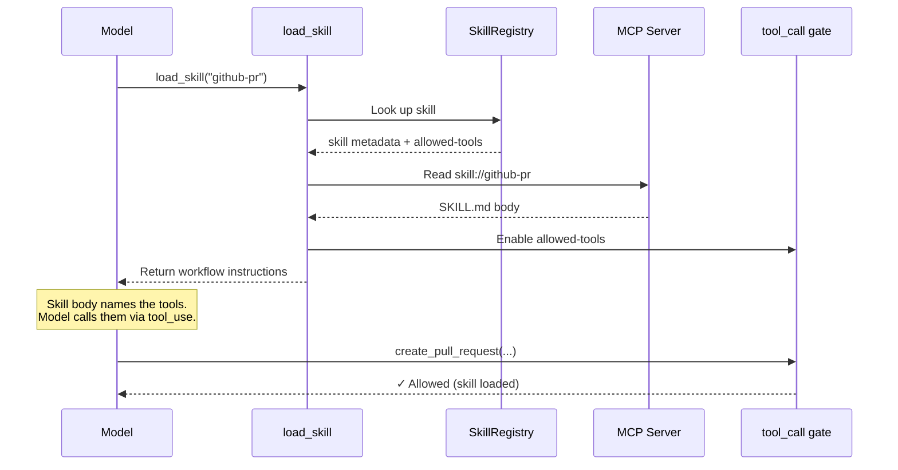

# Tier 1 — The Skill Dealer

MCP servers can ship `skill://` resources: SKILL.md files with frontmatter declaring which tools a skill gates. On connection, the extension discovers all skills and registers their tools with `deferred: true`.

## How deferred tool gating works

Three mechanisms work together to keep tools hidden until the right moment — while preserving prompt cache:

### 1. `deferred: true`

MCP tool proxies are registered with this flag. mcpi keeps them in the tools array (so providers can include them in grammar/dispatch) but excludes them from the system prompt. The tools array stays static throughout the conversation — prompt cache is never invalidated.

### 2. Provider-native `defer_loading`

mcpi's providers map `deferred: true` to their native deferred loading mechanism:

- **Anthropic** — `defer_loading: true` hides the tool from the model's view while keeping it in the grammar.
- **OpenAI Responses** — `defer_loading: true` with auto-injected `{"type": "tool_search"}` enables server-side tool discovery.

Both tested with Claude Opus 4.7 and GPT-5.4. Since the tools array never changes, prompt cache is preserved on both providers.

### 3. `tool_call` hook gating

The extension registers a `tool_call` event handler that blocks premature calls to skill-gated tools. If the model tries to call a gated tool before loading its skill, the handler returns an error:

> _"Tool X requires loading a skill first. Call load_skill with: Y"_

This creates a natural feedback loop and serves as the enforcement layer across all providers — including those without native `defer_loading` support.

## Flow

The MCP server itself declares how its tools should be discovered. The harness holds all the tools as deferred. The skill decides which ones the model can access. The model gets instructions in one atomic operation, paying only the tokens for the skills it actually loads — and the prompt cache stays intact.

## See also

- [skills-as-groups MCP spec proposal](https://github.com/modelcontextprotocol/experimental-ext-grouping/pull/13)
- [DECISIONS.md #008](../DECISIONS.md) — cache-safe progressive tool disclosure
