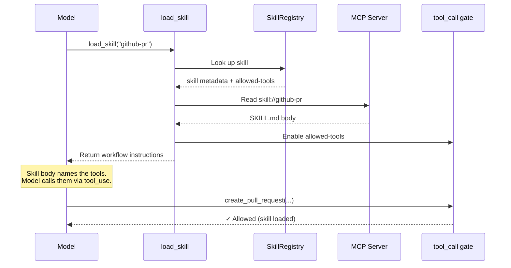

# Tier 1 — The Skill Dealer

MCP servers can ship `skill://` resources: SKILL.md files with frontmatter declaring which tools a skill gates. On connection, the extension discovers all skills and registers their tools with `deferred: true`.

## How deferred tool gating works

Three mechanisms work together to keep tools hidden until the right moment — while preserving prompt cache:

### 1. `deferred: true`

MCP tool proxies are registered with this flag. mcpi's runtime keeps them in the internal registry for execution dispatch (via `resolveTool`) but excludes them from the tools array and system prompt sent to the model.

In `agent-session.ts`, `setActiveToolsByName()` filters deferred tools out of the prompt:

```typescript
if (!tool.deferred) {
  promptToolNames.push(name);
}
```

### 2. Provider-native `defer_loading`

mcpi's providers map `deferred: true` to the native API parameter:

**Anthropic** — `defer_loading: true` keeps the tool in the grammar but hidden from the model's view. The skill body naming the tools is sufficient for the model to call them.

**OpenAI Responses** — `defer_loading: true` plus auto-injected `{"type": "tool_search"}`. The model discovers deferred tools via server-side search.

Both tested with Claude Opus 4.7 and GPT-5.4.

### 3. `tool_call` hook gating

The extension registers a `tool_call` event handler that blocks premature calls to skill-gated tools. If the model tries to call a gated tool before loading its skill, the handler returns an error:

> _"Tool X requires loading a skill first. Call load_skill with: Y"_

This creates a natural feedback loop and serves as the provider-agnostic enforcement layer.

## Flow



The MCP server itself declares how its tools should be discovered. The harness holds all the tools as deferred. The skill decides which ones the model can access. The model gets instructions in one atomic operation, paying only the tokens for the skills it actually loads — and the prompt cache stays intact.

## Comparison with Anthropic tool search

Anthropic's [tool search](https://platform.claude.com/docs/en/agents-and-tools/tool-use/tool-search-tool) solves a similar problem — deferring tool loading to avoid cache invalidation. Where tool search has the model _pull_ tools on demand, skill invocation _pushes_ them: when `load_skill` fires, the skill's tools are unblocked and the model gets workflow instructions. The model doesn't search for tools — the right tools arrive because the skill declared them.

## See also

- [skills-as-groups MCP spec proposal](https://github.com/modelcontextprotocol/experimental-ext-grouping/pull/13)
- [DECISIONS.md #008](../DECISIONS.md) — cache-safe progressive tool disclosure
