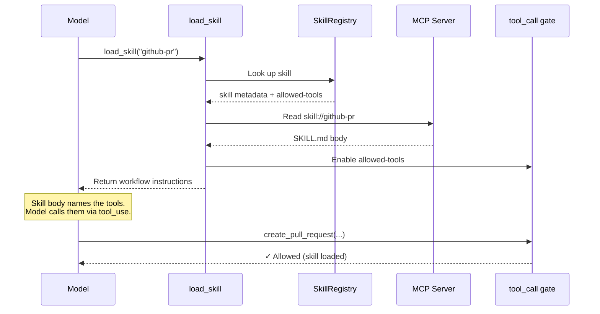

# Tier 1 — The Skill Dealer

MCP servers can ship `skill://` resources: SKILL.md files with frontmatter declaring which tools a skill gates. On connection, the extension discovers all skills and registers their tools with `deferred: true`.

Use a skill when the task matches a documented domain workflow the server has authored — the skill supplies the sequencing and conventions alongside the tools. Loading one **enables its declared tools only after the grant is approved**; the declaration alone confers nothing. For choosing between skills and the other execution facilities, see the `<execution_routing>` section described in [AGENTS.md](../AGENTS.md#execution-routing-srcrouting) — it compares facilities by task shape, and there is no rule that skills should be tried first.

## How deferred tool gating works

Three mechanisms work together to keep tools hidden until the right moment — while preserving prompt cache:

### 1. `deferred: true`

MCP tool proxies are registered with this flag. mcpi keeps them in the tools array (so providers can include them in grammar/dispatch) but excludes them from the system prompt. The tools array stays static throughout the conversation — prompt cache is never invalidated.

### 2. Provider-native `defer_loading`

mcpi's providers map `deferred: true` to their native deferred loading mechanism:

- **Anthropic** — `defer_loading: true` hides the tool from the model's view while keeping it in the grammar.
- **OpenAI Responses** — `defer_loading: true` with auto-injected `{"type": "tool_search"}` enables server-side tool discovery.

Both tested with Claude Opus 4.7 and GPT-5.4. Since the tools array never changes, prompt cache is preserved on both providers.

### 3. `tool_call` hook gating

The extension registers a `tool_call` event handler that blocks premature calls to skill-gated tools. If the model tries to call a gated tool before loading its skill, the handler returns an error:

> _"Tool X requires loading a skill first. Call load_skill with: Y"_

This creates a natural feedback loop and serves as the enforcement layer across all providers — including those without native `defer_loading` support.

## Flow



The MCP server itself declares how its tools should be discovered. The harness holds all the tools as deferred. The skill decides which ones the model can access. The model gets instructions in one atomic operation, paying only the tokens for the skills it actually loads — and the prompt cache stays intact.

## Two discovery contracts

Skills reach the host by one of two routes, and they are never mixed on the same server.

|             | Legacy `skill://` resources             | SEP-2640 skills extension                            |
| ----------- | --------------------------------------- | ---------------------------------------------------- |
| Discovery   | `resources/list` filtered by URI scheme | `skills/list`                                        |
| Trust model | URI shape                               | SHA-256 digest + declared byte size                  |
| Status      | Compatibility fallback                  | Draft, opt-in                                        |
| Used when   | The server declares no extension        | The server declares `io.modelcontextprotocol/skills` |

### ⚠️ SEP-2640 support is DRAFT and off by default

This client targets **[SEP-2640](https://github.com/modelcontextprotocol/modelcontextprotocol/pull/2640) revision `753b9f2be43e07fdd070e535d75f190cff14beea`** — an unratified proposal on the Extensions Track. The wire format can change without notice, and nothing here should be read as support for a finalized specification.

It is therefore gated, and the gate defaults to **off**:

```jsonc
// mcp config
{ "experimental": { "skillsExtension": true } }
```

```sh
mcpi --extension ./dist/index.js --mcp-skills-extension
```

With the gate off the extension is never advertised at `initialize`, so no server can negotiate it and the legacy path always applies. With the gate on, the host logs a visible diagnostic naming the revision and status at startup, and logs the negotiated outcome per server.

### Negotiation

The capability is advertised per request under [SEP-2133](https://github.com/modelcontextprotocol/modelcontextprotocol/pull/2133) semantics:

```json
{
  "capabilities": { "extensions": { "io.modelcontextprotocol/skills": { "directoryRead": true } } }
}
```

`directoryRead` is the only defined setting; `{}` means the extension is supported without directory reads. Support is **re-resolved from the server's declared capabilities immediately before every request** rather than cached at connect time — a listing's contents may be cached, but the right to ask never is. `skills/list` and `skills/get` are refused unless the server declared the extension; `resources/directory/read` is refused unless it declared `directoryRead: true`.

### Integrity model

Every skill entry must publish a `resources` array of `{uri, digest, size}` or the literal string `"dynamic"`. Verification is layered, and each layer catches something the others cannot:

1. **Before any fetch** — the entry alone must satisfy the limits: at most **512** resource entries, at most **16 MiB** summed across `size`. A `"dynamic"` entry authorizes no URIs up front and has the 16 MiB budget applied to what it actually retrieves.
2. **Digest format** — exactly `sha256:` followed by 64 lowercase hex characters. An uppercase or malformed digest is rejected, never normalized.
3. **On every read** — the returned bytes are checked against the declared size first, then against the SHA-256 of the raw bytes. There is no "already verified" shortcut; a digest that matched last time says nothing about the bytes that just arrived. There is deliberately no API that returns unverified bytes.
4. **Membership** — a read resolves only to a URI listed in _that_ skill's `resources`. The policy keys allowlists by `serverName` + `skillUri`, so a file listed by skill A cannot be read while loading skill B, and a skill from server A can never cause a read against server B.
5. **After fetching SKILL.md** — the frontmatter is reparsed from the retrieved document and compared **field by field** against what the listing advertised. Any discrepancy — a changed value, a declared-but-absent field, or an undeclared field smuggled into the file — refuses the load.
6. **Name/path** — the final path segment of the entry URI must equal `frontmatter.name`.

Digests are not a security boundary; they prove the bytes match what was advertised, not that what was advertised is safe.

### Approval is bound to content, not to a name

An MCP-origin skill's `allowed-tools` stays **inert until the user explicitly approves it**. The grant key includes a fingerprint of the skill's resource set, so a server that rotates its content after approval produces a different key and is re-prompted rather than inheriting the old answer. At load time the grant is rebuilt from the entry the server _just_ served, so an `allowed-tools` list that grew since discovery cannot ride in on an approval given for a smaller one.

Content is fetched lazily — never on connection, never at listing, never at approval. SKILL.md is read when the skill loads; a supporting file when it is actually read.

Nothing in a skill is executed. Helper code and host-execution instructions in a SKILL.md body are content, not commands.

### Caching

`ttlMs` and `cacheScope` are freshness hints, not integrity properties. They are honoured conservatively: only `session` and `connection` scopes, only from page 1 of a listing, capped at five minutes, never for a truncated listing, and never for `skills/get` (which is the recovery path when a digest fails). Names collide across servers rather than being deduplicated — an incumbent keeps the bare name and a same-named skill from another origin is registered as `server/name`, with the collision recorded rather than silently dropped.

**An empty `skills/list` is not proof that a server has no skills.** It means the server published nothing right now. A server that declares the extension is served by the extension path alone, even when the listing is empty and even when the extension path errors — falling back to the legacy contract there is exactly the mixing the spec forbids.

## See also

- [SEP-2640 — skills extension](https://github.com/modelcontextprotocol/modelcontextprotocol/pull/2640) (Draft)
- [skills-as-groups MCP spec proposal](https://github.com/modelcontextprotocol/experimental-ext-grouping/pull/13)
- [DECISIONS.md #008](../DECISIONS.md) — cache-safe progressive tool disclosure
- [DECISIONS.md #016](../DECISIONS.md) — draft-gated SEP-2640 client
