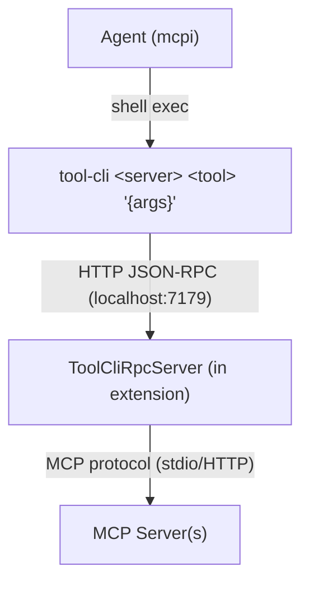

# Tier 2 — The Nuclear Football (tool-cli)

`tool-cli` is a thin CLI binary that speaks JSON-RPC 2.0 to the extension over HTTP. The agent uses it like any shell command — composable with pipes, grep, jq, loops.

## Architecture



The RPC server lives in the extension process, started on `session_start` and stopped on `session_shutdown`. The CLI binary uses `fetch` to call it.

## Progressive discovery

The agent pays only the tokens it needs:

```sh
tool-cli --help                              # What servers exist?
tool-cli github                              # What tools does this server have?
tool-cli github search_code                  # What's the schema for this tool?
tool-cli github search_code '{"query":"auth"}' # Call it
```

## Shell composability

```sh
# Chain tool calls
tool-cli myserver list_items '{}' | jq -r '.[0].id' | \
  xargs -I{} tool-cli myserver get_item '{"id":"{}"}'

# Process collections
for city in London Tokyo Paris; do
  echo "=== $city ==="
  tool-cli weather check_weather '{"city":"'"$city"'"}'
done

# Combine with the Unix toolbox
tool-cli myserver export_csv '{"table":"users"}' | sort -t, -k2 | head -20
```

## Security

The RPC server binds to `127.0.0.1` only. Currently no authentication — any local process can call it. Future work: shared secret token passed via environment variable. See [DECISIONS.md #010](../DECISIONS.md).

The RPC server is the single choke point for all tool execution — the natural interception point for future human-in-the-loop confirmation on destructive operations.

## Security

The server uses token-based auth and dynamic port allocation (since `@sammorrowdrums/tool-cli@0.2.0`):

1. `start()` binds to a random port and generates a 32-byte session token
2. Returns `{ port, token }` — the extension sets these as env vars for agent subprocesses
3. Every request must include `Authorization: Bearer <token>` — rejected with 401 otherwise

This enables concurrent sessions and prevents random processes from calling MCP tools. See [DECISIONS.md #010](../DECISIONS.md) and [tool-cli security docs](https://github.com/SamMorrowDrums/tool-cli#security).
