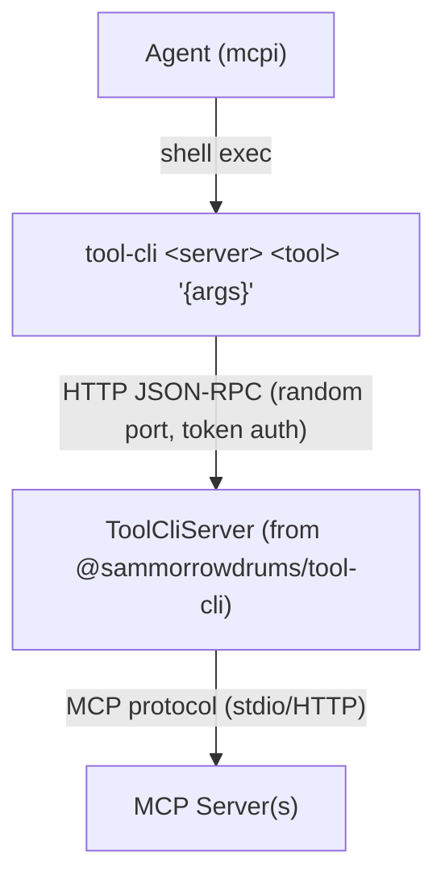

# Tier 2 — The Nuclear Football (tool-cli)

`tool-cli` is a thin CLI binary that speaks JSON-RPC 2.0 to the extension over HTTP. The agent uses it like any shell command — composable with pipes, grep, jq, loops.

## How the agent invokes it

`tool-cli` is a **program, not a tool**. There is no `tool-cli` entry in the agent's tool registry. To run it the agent invokes the host **bash tool** with a command line such as `tool-cli github search_code '{"query":"auth"}'`. Emitting `<tool_cli>…</tool_cli>` markup, or writing a plausible-looking transcript of a command and its output, does not run anything — that text is a hallucination, not an invocation.

The extension states this directly in the prompt. The usage documentation is emitted under the tag `<tool_cli_usage_docs>`, deliberately named so it does not read like an action the model can perform: it is reference material describing a program, not a call site. (It was previously `<tool_cli>`, which invited exactly the pseudo-call failure above.) `src/routing/tripwire.ts` ships `detectToolCliTripwires` as a regression guard for both shapes of that mistake.

`<tool_cli_usage_docs>` is emitted **only after the local RPC server has actually started**. If startup fails, the section is withheld and the failure is reported in the `<execution_routing>` availability line with a next step, rather than being swallowed — an agent that is told how to use a facility that is not running will waste turns on commands that cannot succeed.

For choosing _between_ tool-cli and the other execution facilities, see the `<execution_routing>` section described in [AGENTS.md](../AGENTS.md#execution-routing-srcrouting).

## Architecture



The RPC server lives in the extension process, started on `session_start` and stopped on `session_shutdown`. The CLI binary uses `fetch` to call it.

Tool execution returns the same terminal MCP `CallToolResult` used by direct tools
and Code Mode. Text, image, audio, resource links, embedded resources, arbitrary
JSON `structuredContent`, and `isError` are retained through the provider boundary.
Protocol and transport failures remain rejected RPC calls rather than being
converted into successful-looking tool results.

## Progressive discovery

The agent pays only the tokens it needs:

```sh
tool-cli --help                              # What servers exist?
tool-cli github                              # What tools does this server have?
tool-cli github search_code                  # What's the schema for this tool?
tool-cli github search_code '{"query":"auth"}' # Call it
```

## Shell composability

```sh
# Chain tool calls
tool-cli myserver list_items '{}' | jq -r '.[0].id' | \
  xargs -I{} tool-cli myserver get_item '{"id":"{}"}'

# Process collections
for city in London Tokyo Paris; do
  echo "=== $city ==="
  tool-cli weather check_weather '{"city":"'"$city"'"}'
done

# Combine with the Unix toolbox
tool-cli myserver export_csv '{"table":"users"}' | sort -t, -k2 | head -20
```

## Security

The server uses token-based auth and dynamic port allocation (provided by [`@sammorrowdrums/tool-cli`](https://github.com/SamMorrowDrums/tool-cli)):

1. `start()` binds to a random port and generates a 32-byte session token
2. Returns `{ port, token }` — the extension sets these as env vars via `pi.setEnv()`
3. Every request must include `Authorization: Bearer <token>` — rejected with 401 otherwise

This enables concurrent sessions and prevents random processes from calling MCP tools. Authentication is not authorization, though: `ToolCliServer.callTool` forwards `server`/`tool`/`args` to the provider without checking them against the discovered set, so an authenticated caller could otherwise name a tool the CLI never advertised. `createPolicyToolProvider` routes every RPC call back through `McpPolicy` — the shared authorization boundary that also serves the proxy, Code Mode, and resource paths — which is where tool annotations are checked and non-read-only calls are gated through user confirmation.

See [tool-cli security docs](https://github.com/SamMorrowDrums/tool-cli#security) and [DECISIONS.md #010](../DECISIONS.md).
