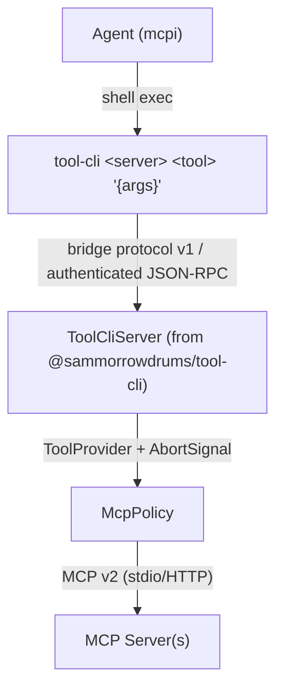

# tool-cli

`tool-cli` is a thin CLI binary that speaks authenticated tool-cli bridge protocol v1 over JSON-RPC 2.0 to the extension. The agent uses it like any shell command — composable with pipes, grep, jq, loops.

## How the agent invokes it

`tool-cli` is a **program, not a tool**. There is no `tool-cli` entry in the agent's tool registry. To run it the agent invokes the host **bash tool** with a command line such as `tool-cli github search_code '{"query":"auth"}'`. Emitting `<tool_cli>…</tool_cli>` markup, or writing a plausible-looking transcript of a command and its output, does not run anything — that text is a hallucination, not an invocation.

The extension states this directly in the prompt. The usage documentation is emitted under the tag `<tool_cli_usage_docs>`, deliberately named so it does not read like an action the model can perform: it is reference material describing a program, not a call site. (It was previously `<tool_cli>`, which invited exactly the pseudo-call failure above.) `src/routing/tripwire.ts` ships `detectToolCliTripwires` as a regression guard for both shapes of that mistake.

`<tool_cli_usage_docs>` is emitted **only after bash is active and the local bridge completes an authenticated, compatible v1 `getBridgeInfo` handshake**. The handshake reports the tool-cli implementation version, deterministic operations and capabilities, and a live summary of each upstream MCP connection. Handshakes are serialized because the package client reads its endpoint from process environment; their target and the agent subprocess environment are pinned to loopback so an inherited `TOOL_CLI_HOST` cannot receive the fresh bearer token. Inherited port/token credentials are masked until verification succeeds. Startup, authentication, timeout, and major-version compatibility failures withhold the section and appear in `<execution_routing>` with an actionable reason.

For choosing _between_ tool-cli and the other execution facilities, see the `<execution_routing>` section described in [AGENTS.md](../AGENTS.md#execution-routing-srcrouting).

## Architecture



The RPC server lives in the extension process, started on `session_start` and stopped on `session_shutdown`. The CLI binary uses finite-timeout `fetch` calls. Client cancellation reaches the provider as an `AbortSignal`, crosses `McpPolicy`, and is forwarded to MCP v2 tool and resource requests.

Tool execution returns the same terminal MCP `CallToolResult` used by direct tools and Code Mode. Text, image, audio, resource links, embedded resources, arbitrary JSON `structuredContent` (including falsey and null values), `isError`, and modern extension fields are retained through the provider boundary. Protocol and transport failures remain rejected RPC calls rather than being converted into successful-looking tool results.

## Progressive discovery

The agent pays only the tokens it needs:

```sh
tool-cli --help                                # What servers exist?
tool-cli github                               # What tools does this server have?
tool-cli github search_code                   # What's the schema for this tool?
tool-cli github search_code '{"query":"auth"}' # Call it
```

## Resources

The v1 bridge supports policy-authorized MCP resources as well as tools:

```sh
tool-cli resource list --server docs
tool-cli resource templates --server docs
tool-cli resource read --server docs file:///readme.md
tool-cli resource read --server media file:///image.png --out /tmp/image.png
```

Resource metadata and modern text/blob fields are retained losslessly. `--out` base64-decodes binary blobs to the named file. `skill://` resources/templates and SEP-2640-declared skill resources under any URI scheme are deliberately excluded: they carry workflow instructions and grants, so they remain isolated behind skill discovery and `load_skill`. The policy also refuses an otherwise ordinary read if any returned content block identifies a skill-owned URI, preventing a server from smuggling hidden instructions in a multi-resource response.

## Shell composability

```sh
# Chain tool calls
tool-cli myserver list_items '{}' | jq -r '.[0].id' | \
  xargs -I{} tool-cli myserver get_item '{"id":"{}"}'

# Process collections
for city in London Tokyo Paris; do
  echo "=== $city ==="
  tool-cli weather check_weather '{"city":"'"$city"'"}'
done

# Combine with the Unix toolbox
tool-cli myserver export_csv '{"table":"users"}' | sort -t, -k2 | head -20
```

## Security and compatibility

The server uses token-based auth and dynamic port allocation (provided by [`@sammorrowdrums/tool-cli`](https://github.com/SamMorrowDrums/tool-cli)):

1. `start()` binds to a random port and generates a 32-byte session token.
2. The extension uses `{ port, token }` privately for authenticated `getBridgeInfo`.
3. mcpi-ext requires bridge protocol major 1, the complete v1 operation/capability set, an implementation version, and an upstream MCP summary.
4. Only then does it set `TOOL_CLI_PORT` and `TOOL_CLI_TOKEN` via `pi.setEnv()`.
5. Every later request must carry `Authorization: Bearer <token>` and is rejected with 401 otherwise.

This enables concurrent sessions and prevents random processes from calling MCP tools. Authentication is not authorization, though: an authenticated caller can still name arbitrary servers, tools, arguments, and resource URIs. `createPolicyToolProvider` exposes exactly the policy-visible tool schemas and routes each tool/resource operation back through `McpPolicy` once, where discovery, skill gating, input validation, resource isolation, cancellation, audit, and non-read-only confirmation are enforced before upstream dispatch.

Stdio MCP children receive the MCP SDK's safe inherited environment plus their explicit configuration, with every `TOOL_CLI_*` variable stripped. A child server therefore cannot inherit this session's bridge credentials, including when mcpi itself was started from another mcpi session.

See [tool-cli security docs](https://github.com/SamMorrowDrums/tool-cli#security), [DECISIONS.md #010](../DECISIONS.md), and [DECISIONS.md #018](../DECISIONS.md).
